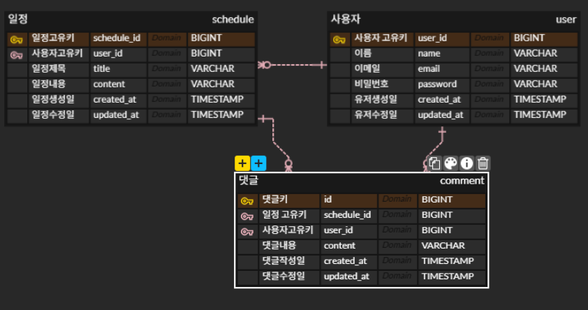

# Scheduler 프로젝트
---
## 1. 프로젝트 개요
이 프로젝트는 **일정 관리 시스템**으로, 사용자가 일정을 생성하고 관리하며 댓글을 달 수 있는 웹 애플리케이션입니다. 주요 기능은 **유저 관리**, **일정 CRUD**, **댓글 CRUD**, **로그인/로그아웃**으로 구성되어 있으며, **Spring Boot**와 **MySQL**을 사용합니다. 또한, **세션** 기반 인증과 **페이지네이션** 기능을 제공합니다.

---
## 2. ERD

---
## 3. API명세서
[https://documenter.getpostman.com/view/24302728/2sB3Wwqx9n](https://documenter.getpostman.com/view/24302728/2sB3Wwqx9n)

---
## 4. 기술 스택

- Java 17
- Spring Boot 3.5.7
- JPA (Java Persistence API)
- MySQL
- OpenFeign QueryDsl
- Lombok
- SLF4J
- JUnit 5

---

## 5. 주요 기능

### 유저 (User)
- 회원 가입 (Create)
- 유저 정보 조회 (Read)
- 유저 정보 수정 (Update)
- 회원 탈퇴 (Delete)

### 일정 (Schedule)
- 일정 생성 (Create)
- 일정 조회 (Read)
- 일정 수정 (Update)
- 일정 삭제 (Delete)
- 일정 목록 페이지네이션

### 댓글 (Comment)
- 댓글 등록 (Create)
- 댓글 조회 (Read)
- 댓글 수정 (Update)
- 댓글 삭제 (Delete)

### 인증 (Auth)
- 로그인 (Session 기반)
- 로그아웃
- 세션 기반 인증/인가
-------

## 6. 추가기능

### 비밀번호 암호화
- **at.favre.lib:bcrypt** 라이브러리를 사용하여 비밀번호를 안전하게 암호화하고, 로그인 시 비교합니다.

### 예외 처리
- **전역 예외 처리**를 통해 애플리케이션에서 발생하는 예외를 통합적으로 처리합니다.
- **커스텀 예외**를 사용하여 특정한 에러 코드를 반환하고, 예외 발생 시 사용자에게 명확한 오류 메시지를 제공합니다.

### N+1 문제 해결
- **JPA**에서 발생할 수 있는 N+1 문제를 **Fetch Join** 및 **DTO 프로젝션** 등을 활용하여 해결했습니다.
    - 예를 들어, 일정과 댓글을 조회할 때 한 번의 쿼리로 연관된 데이터를 모두 가져오도록 최적화했습니다.
